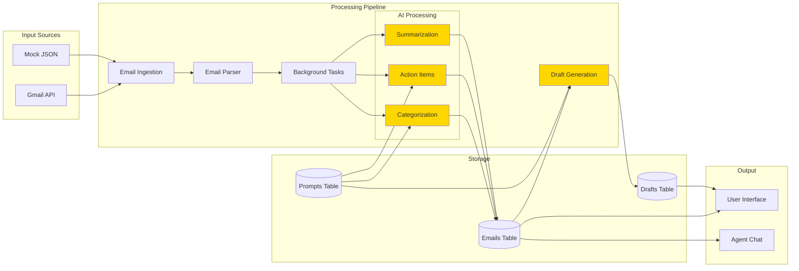
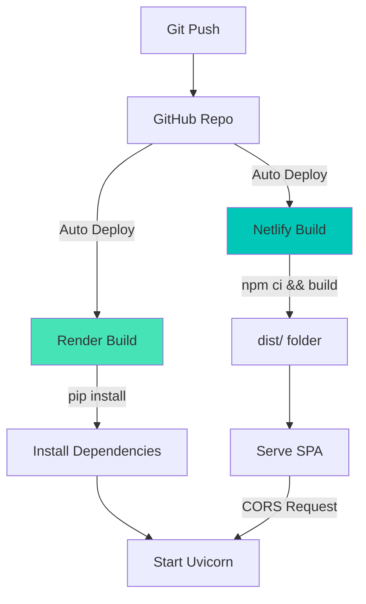

# Email Summarizer Agent

An AI-powered email productivity assistant with intelligent categorization, action item extraction, and automated draft generation. Built with React (Vite) frontend and FastAPI backend, powered by Google's Gemini 2.0 Flash.

## 📋 Table of Contents
- [System Design](#-system-design)
- [Features](#-features)
- [Tech Stack](#-tech-stack)
- [Architecture](#-architecture)
- [Setup](#-setup)
- [API Documentation](#-api-documentation)
- [Deployment](#-deployment)

---

## 🏗️ System Design

### High-Level Architecture


### Component Interaction Flow


### Data Flow Architecture



### Database Schema


---

## ✨ Features

### 🎯 Core Capabilities
- **Smart Email Categorization**: Auto-categorize emails (Important, Spam, Promotional, etc.)
- **Action Item Extraction**: Automatically extract tasks and deadlines from emails
- **AI Summarization**: Generate concise summaries of lengthy emails
- **Intelligent Draft Generation**: Create context-aware email replies with suggested follow-ups
- **Conversational Agent**: Context-aware chatbot for inbox queries and email assistance
- **Prompt Brain**: Customize AI behavior by editing system prompts

### 🔄 Workflows
1. **Email Processing**: Gmail sync → Parse → Background AI processing
2. **Draft Creation**: Email selection → AI draft generation → User editing → Save
3. **Agent Interaction**: Inbox context + specific email + conversation history → LLM response

---

## 🛠️ Tech Stack

### Frontend
| Technology | Purpose |
|------------|---------|
| **React 18** | UI framework |
| **Vite** | Build tool & dev server |
| **React Router v6** | Client-side routing |
| **Axios** | HTTP client |
| **CSS3** | Styling |

### Backend
| Technology | Purpose |
|------------|---------|
| **FastAPI** | REST API framework |
| **SQLAlchemy** | ORM for database |
| **SQLite** | Lightweight database |
| **Pydantic** | Data validation |
| **Google Generative AI** | Gemini 2.0 Flash integration |
| **Gmail API** | Email fetching |

### Infrastructure
- **Netlify**: Frontend hosting (SPA deployment)
- **Render**: Backend hosting (Python web service)
- **Git**: Version control

---

## 🏛️ Architecture

### Monorepo Structure
```
emailsummarizer-main/
├── emailsummarizer-main/
│   ├── frontend/              # React application
│   │   ├── src/
│   │   │   ├── components/   # Inbox, EmailDetail, DraftEditor, etc.
│   │   │   ├── App.jsx       # Main app component
│   │   │   └── config.js     # API configuration
│   │   ├── public/
│   │   ├── package.json
│   │   └── vite.config.js
│   └── backend/              # FastAPI application
│       ├── main.py           # API routes
│       ├── llm.py            # Gemini AI integration
│       ├── store.py          # Data access layer
│       ├── database.py       # SQLAlchemy models
│       ├── auth.py           # Gmail OAuth
│       ├── mock_data/        # Test data
│       └── requirements.txt
├── netlify.toml
├── render.yaml
└── README.md
```

### Key Backend Modules

| Module | Responsibility |
|--------|---------------|
| `main.py` | API endpoints, CORS, background tasks |
| `llm.py` | Gemini API wrapper, prompt engineering |
| `store.py` | Database operations (CRUD) |
| `database.py` | SQLAlchemy models and DB setup |
| `auth.py` | Gmail API authentication |

### Frontend Architecture


---

## 🚀 Setup

### Prerequisites
- **Node.js** 18+ and npm
- **Python** 3.10+
- **Google Cloud Account** (for Gemini API key)

### Environment Variables

#### Frontend `.env`
```env
VITE_API_BASE_URL=http://localhost:8000
```

#### Backend `.env`
```env
GEMINI_API_KEY=your_gemini_api_key_here
FRONTEND_ORIGIN=http://localhost:5173
SUMMARY_PROMPT=Please provide a concise summary...
CATEGORY_PROMPT=Categorize this email as...
ACTION_ITEMS_PROMPT=Extract action items as JSON...
```

### Local Development

#### 1. Backend Setup
```bash
cd emailsummarizer-main/emailsummarizer-main/backend
pip install -r requirements.txt
cp .env.example .env  # Then edit .env with your keys
python -m uvicorn main:app --host 0.0.0.0 --port 8000 --reload
```

Backend will run at `http://localhost:8000`

#### 2. Frontend Setup
```bash
cd emailsummarizer-main/emailsummarizer-main/frontend
npm install
cp .env.example .env  # Then edit .env
npm run dev
```

Frontend will run at `http://localhost:5173`

---

## 📡 API Documentation

### Email Endpoints

| Method | Endpoint | Description |
|--------|----------|-------------|
| `GET` | `/emails` | Fetch all emails |
| `GET` | `/emails/{email_id}` | Get single email |
| `GET` | `/emails/load-mock` | Load mock inbox data |
| `GET` | `/gmail/sync` | Sync from Gmail API |
| `POST` | `/emails/{email_id}/process` | Trigger AI processing |

### Draft Endpoints

| Method | Endpoint | Description |
|--------|----------|-------------|
| `GET` | `/drafts` | List all drafts |
| `GET` | `/drafts/{draft_id}` | Get single draft |
| `POST` | `/drafts` | Generate new draft |
| `PUT` | `/drafts/{draft_id}` | Update draft |
| `DELETE` | `/drafts/{draft_id}` | Delete draft |

### Agent Endpoints

| Method | Endpoint | Description |
|--------|----------|-------------|
| `POST` | `/agent/chat` | Chat with AI agent |
| `GET` | `/prompts` | Get all system prompts |
| `POST` | `/prompts` | Update prompts |

### Example Request: Generate Draft
```bash
curl -X POST http://localhost:8000/drafts \
  -H "Content-Type: application/json" \
  -d '{
    "email_id": "abc123",
    "instructions": "Write a polite decline"
  }'


```

**Response:**
```json
{
  "id": 1,
  "subject": "Re: Meeting Request",
  "body": "Thank you for reaching out...",
  "suggested_follow_ups": [
    "Schedule a follow-up call",
    "Send calendar availability"
  ],
  "metadata": {
    "tone": "professional",
    "confidence": 0.92
  }
}
```

---

## 🌐 Deployment

### Netlify (Frontend)

**Configuration:** `netlify.toml`
```toml
[build]
  base = "emailsummarizer-main/emailsummarizer-main/frontend"
  command = "npm ci && npm run build"
  publish = "dist"

[[redirects]]
  from = "/*"
  to = "/index.html"
  status = 200
```

**Environment Variables:**
- `VITE_API_BASE_URL`: Your Render backend URL (e.g., `https://your-app.onrender.com`)

### Render (Backend)

**Configuration:** `render.yaml`
```yaml
services:
  - type: web
    name: email-agent-backend
    env: python
    rootDir: emailsummarizer-main/emailsummarizer-main/backend
    buildCommand: pip install -r requirements.txt
    startCommand: uvicorn main:app --host 0.0.0.0 --port $PORT
    envVars:
      - key: GEMINI_API_KEY
        sync: false
      - key: FRONTEND_ORIGIN
        value: https://your-netlify-site.netlify.app
```

**Environment Variables:**
- `GEMINI_API_KEY`: Your Google Gemini API key
- `FRONTEND_ORIGIN`: Your Netlify frontend URL

### Deployment Workflow



---

## 📝 Notes

- **CORS**: Backend uses `FRONTEND_ORIGIN` environment variable for CORS configuration
- **Secrets**: Never commit `.env` files or API keys (already in `.gitignore`)
- **Database**: SQLite file (`email_agent.db`) is created automatically on first run
- **Background Tasks**: Email processing runs asynchronously using FastAPI's `BackgroundTasks`
- **Mock Data**: Use `/emails/load-mock` for testing without Gmail authentication

---

## 🤝 Contributing

This project is a demonstration of modern full-stack development with AI integration. Feel free to fork and enhance!

## 📄 License

MIT License - See LICENSE file for details